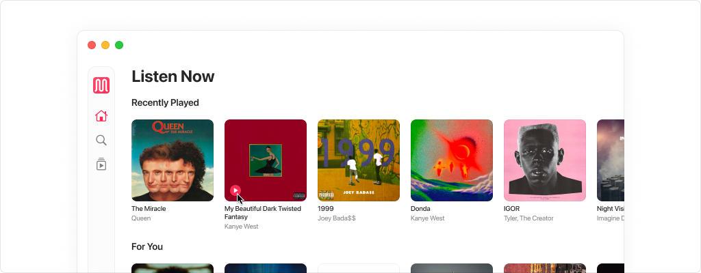

# mupl for macOS


**mupl** – a music player that is fully-written on SwiftUI with a seamless and intuitive interface that feels right at home on macOS. Leveraging the powerful capabilities of [MusicKit](https://developer.apple.com/musickit/), it offers a fully integrated Apple Music experience, allowing users to access their library and explore new music.

## Motivation

The motivation behind developing this macOS music player for Apple Music springs from the widespread dissatisfaction with the official application's performance. Numerous users, including myself, have encountered persistent issues such as bugs, memory leaks, crashes, and overall lack of responsiveness. These problems are not isolated incidents but are echoed across various forums, including Apple Support and Reddit, where a significant number of users have voiced their frustrations. 

Contrasting sharply with its iOS counterpart, which boasts a sleek design and superior technical execution, the macOS version falls short, prompting the need for a reliable, user-friendly alternative that addresses these shortcomings and offers an enhanced listening experience on macOS.

<picture width="1024">
  <source media="(prefers-color-scheme: dark)" srcset="./.github/resources/banner-dark.png">
  
</picture>

## License

```
MIT License

Copyright (c) 2024 Tamerlan Satualdypov

Permission is hereby granted, free of charge, to any person obtaining a copy
of this software and associated documentation files (the "Software"), to deal
in the Software without restriction, including without limitation the rights
to use, copy, modify, merge, publish, distribute, sublicense, and/or sell
copies of the Software, and to permit persons to whom the Software is
furnished to do so, subject to the following conditions:

The above copyright notice and this permission notice shall be included in all
copies or substantial portions of the Software.

THE SOFTWARE IS PROVIDED "AS IS", WITHOUT WARRANTY OF ANY KIND, EXPRESS OR
IMPLIED, INCLUDING BUT NOT LIMITED TO THE WARRANTIES OF MERCHANTABILITY,
FITNESS FOR A PARTICULAR PURPOSE AND NONINFRINGEMENT. IN NO EVENT SHALL THE
AUTHORS OR COPYRIGHT HOLDERS BE LIABLE FOR ANY CLAIM, DAMAGES OR OTHER
LIABILITY, WHETHER IN AN ACTION OF CONTRACT, TORT OR OTHERWISE, ARISING FROM,
OUT OF OR IN CONNECTION WITH THE SOFTWARE OR THE USE OR OTHER DEALINGS IN THE
SOFTWARE.
```
